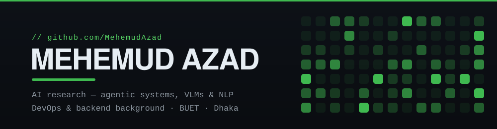

  

  
  
  
  

### `// about`

Final-year CS undergrad at **BUET** who moved from shipping production systems into researching them. I spent my first years deep in **full-stack and DevOps/DevSecOps** — microservice platforms, CI/CD, Kubernetes, CTFs — and now my focus is **agentic AI, vision-language models, and NLP**. I still do the infrastructure work; I just point it at research problems now.

### `// research`

- **Undergrad thesis — vision-language models** — spatial reasoning in VLMs and the mechanistic interpretability behind it.
- **Exploratory test automation with agentic AI** — an agent that explores mobile apps and generates tests without scripted paths.
- **Bangla LLM-text detection** — curating a dataset of Bangla LLM-generated text and building detection methods on top of it.
- **Hallucination &amp; synthetic-media detection** — LLM hallucination detection, plus deepfake detection for images and video.

### `// projects`

<table>
<tr>
<td width="50%" valign="top">

**[Verilens — AI-media detector](https://github.com/MehemudAzad/verilens-chrome-extension)**

Manifest-V3 Chrome extension that flags AI-generated media and misinformation on X, Instagram, and Facebook — C2PA provenance first, then deepfake models and automated fact-checking.

`JavaScript` · `Manifest V3` · `C2PA` · `Deepfake detection`

</td>
<td width="50%" valign="top">

**[Purple Agent — Build-What-I-Mean](https://github.com/MehemudAzad/purple-agent-build-what-i-say)**

Standalone LLM agent for the Build-What-I-Mean benchmark. Two-stage pipeline with speaker-aware pragmatic inference over the A2A protocol.

`Python` · `LLM` · `A2A Protocol`

</td>
</tr>
<tr>
<td width="50%" valign="top">

**[CareForAll — API Avengers 🏆](https://github.com/MehemudAzad/fat32-api-avengers)**

CUET API Avengers **champion**. Event-driven donation platform: FastAPI microservices, Kafka workflows, gRPC comms, full observability, CI/CD, Kubernetes.

`FastAPI` · `Kafka` · `gRPC` · `Kubernetes`

</td>
<td width="50%" valign="top">

**[The Freelancer](https://github.com/MehemudAzad/the-freelancer)**

Microservices freelancing platform — API gateway, JWT auth, escrow payments, workspace collaboration, and vector-search matching.

`Spring Boot` · `Next.js` · `Kafka` · `PostgreSQL`

</td>
</tr>
<tr>
<td width="50%" valign="top">

**[C-to-8086 Compiler](https://github.com/MehemudAzad/CSE-310-COMPILER)**

Full compiler pipeline from scratch: symbol table, Flex lexer, ANTLR4 parser + semantics, 8086 assembly codegen with optimization.

`C++` · `Flex` · `ANTLR4`

</td>
<td width="50%" valign="top">

**[ATmega32 Maze Solver](https://github.com/MehemudAzad/MAZE-SOLVER-ATMEGA32-PROJECT-CSE-316)**

Autonomous maze robot — left-hand-rule search, triple-ultrasonic + MPU6050 fusion, PID-assisted movement on bare hardware.

`C++` · `ATmega32` · `PlatformIO`

</td>
</tr>
</table>

### `// stack`

**also worked with** — Transformers · LangChain · Google ADK · MLflow · gRPC · SonarQube · Trivy · Solidity **and many more**

### `// milestones`

| Result | Event | Field |
|---|---|---|
| **Champion** | CUET API Avengers 2025 | DevOps · microservices |
| **7th** | BUET DL Sprint 4.0 (2026) | NLP / ASR |
| **Bronze** | Kaggle AIMO 3 (2026) | NLP |
| **5th** | CUET Techathon 2025 | IoT |

### `// activity`

  

<picture>
  <source media="(prefers-color-scheme: dark)" srcset="https://raw.githubusercontent.com/MehemudAzad/MehemudAzad/output/github-snake-dark.svg">
  <source media="(prefers-color-scheme: light)" srcset="https://raw.githubusercontent.com/MehemudAzad/MehemudAzad/output/github-snake.svg">
  
</picture>

the rest lives on my <a href="https://mehemudazad.github.io">portfolio</a> &#8594;

